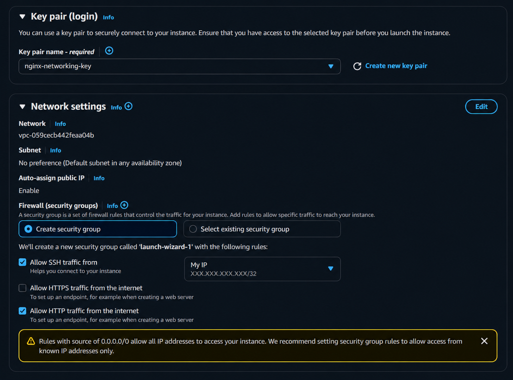
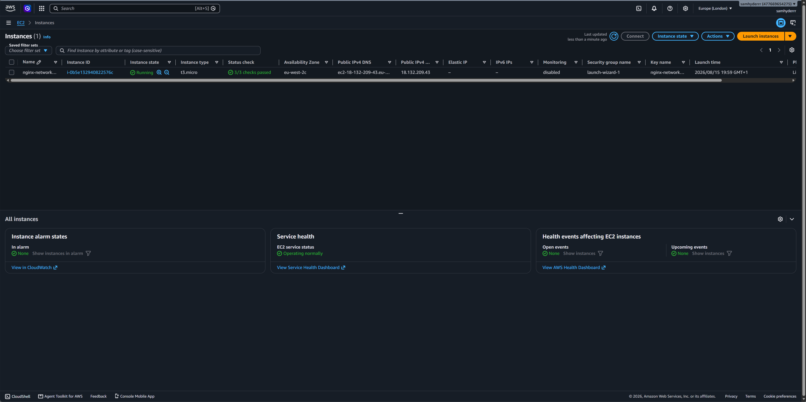
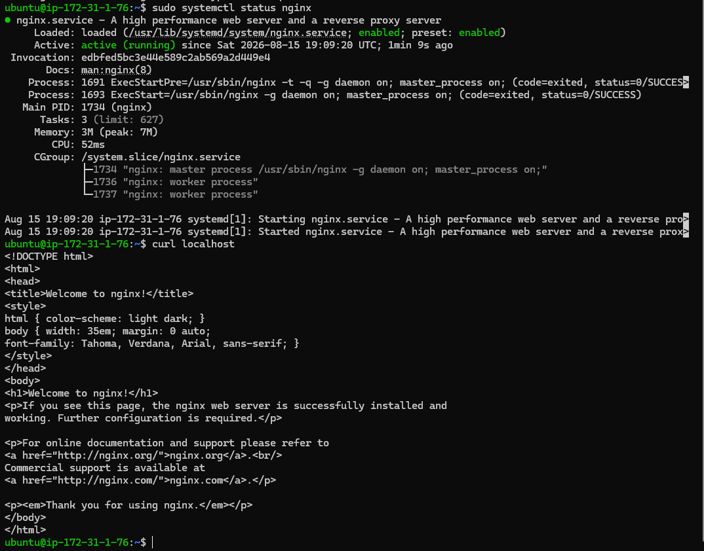
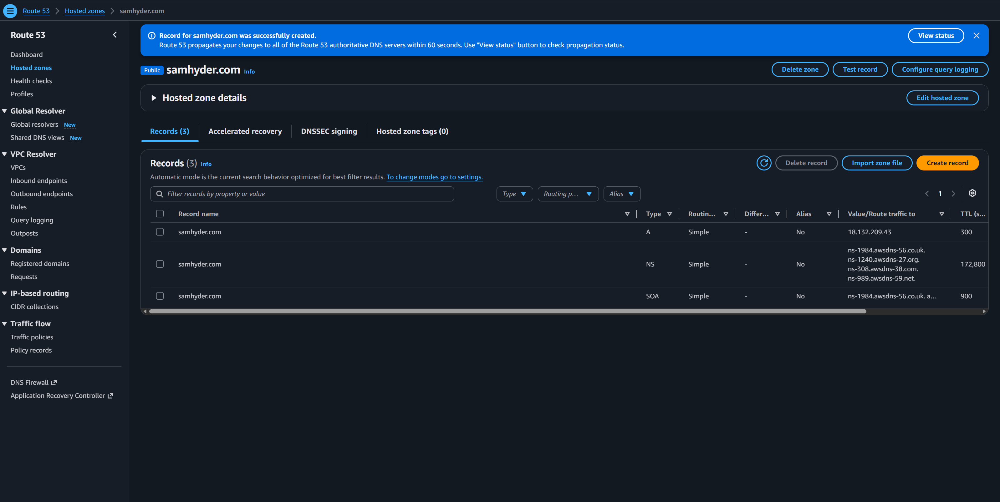
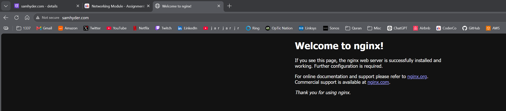

# AWS EC2, NGINX & Route 53 Networking Project

## Project Overview

This project was completed as part of the CoderCo DevOps Networking module.

The objective was to deploy a web server on AWS and make it accessible through my own domain name.

I deployed an Ubuntu EC2 instance, installed NGINX, configured the EC2 security group to allow HTTP traffic, and used AWS Route 53 to point my domain to the EC2 instance.

The final result was a working NGINX web server accessible through:

`http://samhyder.com`

---

## Architecture

The basic flow of traffic is:

```text
User Browser
     |
     | HTTP request to samhyder.com
     v
AWS Route 53
     |
     | DNS A Record
     v
EC2 Public IPv4 Address
     |
     | Port 80
     v
NGINX Web Server
     |
     v
Welcome to nginx!
```

This project helped demonstrate how DNS, IP addressing, firewall rules, ports and web servers work together.

## Technologies Used

- AWS EC2
- AWS Route 53
- Ubuntu Linux
- NGINX
- SSH
- DNS
- HTTP
- Git & GitHub

## Implementation

### 1. EC2 Instance & Security Group



I launched an Ubuntu EC2 instance in AWS.

During the instance configuration, I created a security group with:

- **SSH (Port 22):** restricted to my IP address
- **HTTP (Port 80):** accessible from the internet

HTTP needs to be accessible publicly so users can connect to the NGINX web server.

### 2. EC2 Instance Running



After launching the instance, I confirmed that the EC2 instance was running successfully and had passed its AWS status checks.

The instance was assigned a public IPv4 address which could be used to access the server over the internet.

### 3. Connecting to EC2 & Installing NGINX



I connected to the Ubuntu EC2 instance using SSH and my private key.

Example SSH command:

```bash
ssh -i "nginx-networking-key.pem" ubuntu@<EC2-PUBLIC-DNS>
```

I then installed NGINX:

```bash
sudo apt install nginx -y
```

I checked that the NGINX service was running:

```bash
sudo systemctl status nginx
```

I also tested the web server locally from the EC2 instance:

```bash
curl localhost
```

The response returned the NGINX HTML page, confirming that the web server was working locally.

### 4. Configuring DNS with Route 53



I registered and configured my domain using AWS Route 53.

I created an A record for:

`samhyder.com`

The A record points the domain name to the public IPv4 address of the EC2 instance.

This means that instead of users needing to remember an IP address, DNS translates `samhyder.com` into the IP address of the web server.

### 5. Testing the Website



After the DNS record propagated, I entered:

```text
http://samhyder.com
```

into my browser.

The NGINX welcome page loaded successfully.

This confirmed that the complete network path was working:

Domain → DNS → EC2 → Security Group → Port 80 → NGINX

## Challenges & Troubleshooting

One issue I encountered was receiving a **connection refused** error when attempting to access the EC2 public IP from my browser.

I worked through the problem by checking the different parts of the connection rather than assuming the EC2 instance itself was broken.

I confirmed:

- The EC2 instance was running
- The security group allowed HTTP traffic on port 80
- I could successfully connect to the instance using SSH
- NGINX needed to be installed and running
- `curl localhost` successfully returned the NGINX page

Once NGINX was installed and running, the public IPv4 address successfully displayed the NGINX landing page.

I then configured the Route 53 A record and confirmed that the same server could be reached using my domain name.

## Commands Used

### Install NGINX

```bash
sudo apt install nginx -y
```

### Check the NGINX service

```bash
sudo systemctl status nginx
```

### Test NGINX locally

```bash
curl localhost
```

### Connect to the EC2 instance using SSH

```bash
ssh -i "nginx-networking-key.pem" ubuntu@<EC2-PUBLIC-DNS>
```

## What I Learned

This project helped me understand how several networking concepts work together in a real environment rather than individually.

I gained practical experience with:

- How DNS translates a domain name into an IP address
- How Route 53 A records work
- How public IPv4 addresses allow internet-facing resources to be reached
- How security groups act as virtual firewalls around EC2 instances
- Why HTTP traffic uses port 80
- How SSH allows secure remote administration of a Linux server
- How NGINX listens for and responds to HTTP requests
- How to troubleshoot connectivity by testing each part of the network path individually

The biggest takeaway was understanding that loading a simple website involves multiple components working together:

**DNS resolution → routing to the server → firewall access → application listening on the correct port**